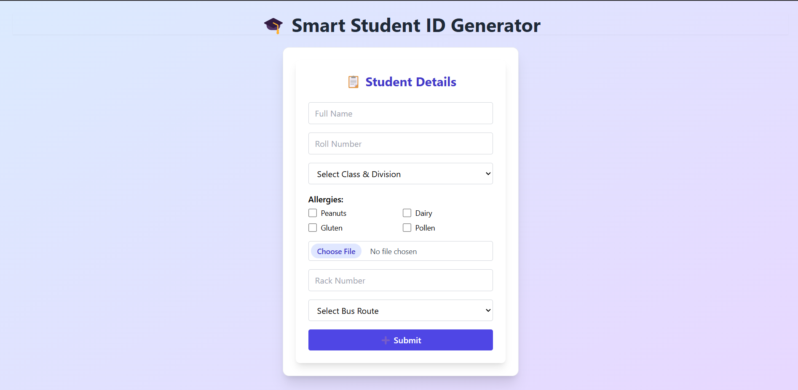
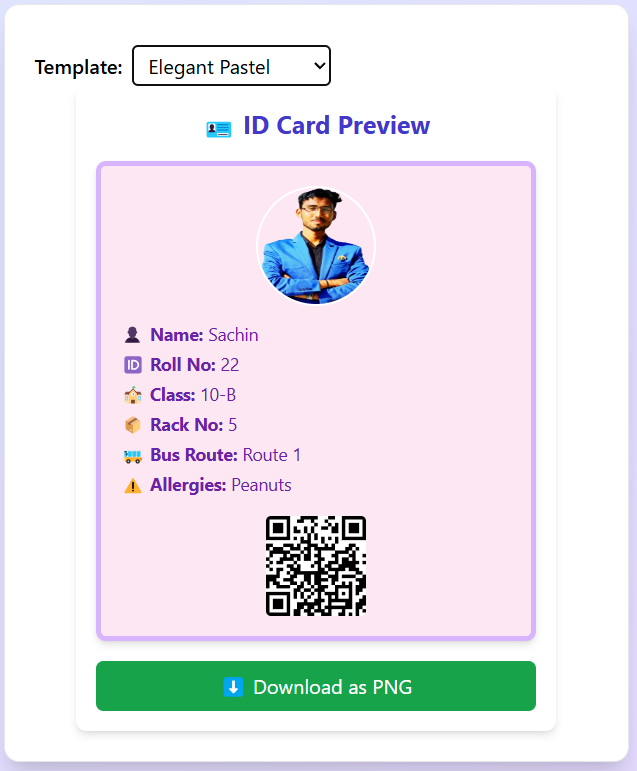
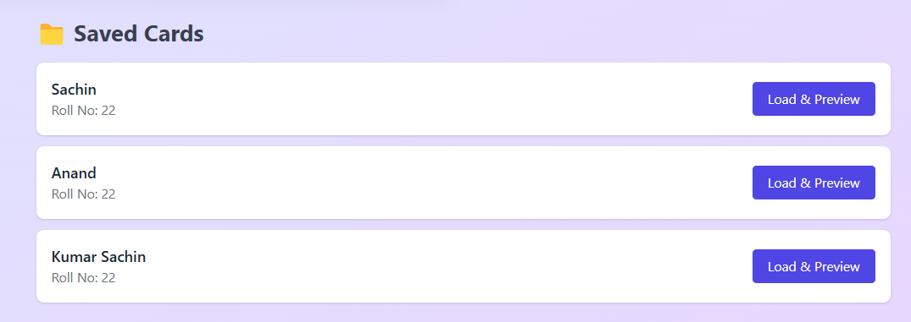

# 🎓 Smart Student ID Generator

A sleek, modern, and dynamic Student ID Card generator built using ReactJS and Tailwind CSS. This project mimics a mini version of Unity’s ID card module and is built with attention to detail, polish, and UX-first thinking.

## 🚀 Features

✅ Beautiful student ID card preview  
✅ Multiple aesthetic templates  
✅ Live QR Code generation  
✅ Form-based data entry  
✅ Save & load entries from localStorage  
✅ Download ID as PNG  
✅ Fully responsive design  
✅ Clean & modular code structure  

## ✨ Live Demo

Try it out on Replit or deploy to Vercel, Netlify, or any static host!

## 📸 Screenshots

### 📝 Elegant Form Input


### 🪪 ID Cards with QR Integration


### 💾 Load & Preview Saved Cards


## 🧠 Thought Process

### 🧩 Problem Breakdown

The goal was to create an intuitive module where users can:
- Input student data
- Preview an ID card in real time
- Switch between design templates
- Save, load, and export these cards

## 🛠️ Technology Decisions

- **ReactJS**: Chosen for its component-based structure and state management.
- **Tailwind CSS**: Rapid styling with a consistent design system.
- **html-to-image**: To convert HTML to downloadable PNG.
- **qrcode.react**: For seamless QR code generation.

## 🎨 UI/UX Considerations

- Clean layout with clear separation between form and preview  
- Mobile-responsive design  
- Bright, pastel gradient backgrounds for visual delight  
- Template switcher with subtle animations  

## 🗂️ Folder Structure

```
/src
 ┣ /components
 ┃ ┣ IDCardPreview.jsx
 ┃ ┣ StudentForm.jsx
 ┃ ┣ TemplateSwitcher.jsx
 ┃ ┗ CardList.jsx
 ┣ App.jsx
 ┗ index.css
```

## 🔧 Installation & Run Locally

```bash
# Install dependencies
npm install

# Run the dev server
npm run dev
```

## 📥 How It Works

1. User fills out the student form (name, roll number, photo, etc.)
2. Real-time preview of the ID card is shown
3. QR Code is generated based on input data
4. User can switch between 5 unique templates:
   - 🌈 Modern Gradient
   - 🧼 Classic Minimal
   - 💡 Techie Neon
   - 🏫 School-Themed
   - 🌸 Elegant Pastel
5. Users can save cards, reload them, or export them as images!

## 📹 Walkthrough Checklist

✅ Form entry  
✅ Template switch  
✅ ID preview with QR Code  
✅ PNG export  
✅ Saved entries reload  

## 🧪 What I Learned

- Using html-to-image to render downloadable components
- Better state management using React Hooks
- Designing clean, accessible, and responsive forms
- Structuring components with scalability in mind
- Creating multiple dynamic UI templates

## 📚 Future Improvements

- Export as PDF  
- Integrate with Firebase for backend storage  
- Add role-based access (Admin/Student)  
- Email or print the ID directly  

## 🧑‍💻 Developed by

**Kumar Sachin**  
Frontend Developer | Passionate UI/UX Designer | IoT & Web Enthusiast  
🔗 [LinkedIn](https://www.linkedin.com/in/cyrossachin/) | ✉️ sachinkc4456@gmail.com
